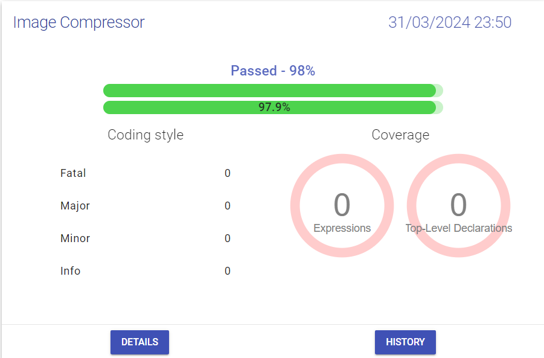

# Image-Compressor

## Project Overview

The Image Compressor is a Haskell-based program that reduces the number of colors in an image using the K-means clustering algorithm. This tool is useful for image compression, where the objective is to reduce the file size by limiting the color palette while maintaining the visual appearance of the image as much as possible.

## Usage

First, compile the project using the provided Makefile. Then, run the Image Compressor with the following command:

``` bash
make
./imageCompressor -n N -l L -f F
```

#### Flags
- `-n N`: Specifies the number of colors in the final compressed image. This is the number of clusters that the K-means algorithm will use.
- `-l L`: Sets the convergence limit. This value determines the stopping criterion for the K-means algorithm. The algorithm stops when the change in cluster centroids is less than this limit.
- `-f F`: Provides the path to the file containing the colors of the pixels. The file should contain pixel data in a specified format that the program can read and process.

#### Example

``` bash
./imageCompressor -n 16 -l 0.01 -f ./path/to/image.txt
```

This command runs the Image Compressor with 16 colors, a convergence limit of 0.01, and the pixel data located in ./path/to/image.txt.


## Project description

The Image Compressor uses the K-means clustering algorithm to reduce the number of colors in an image. Here is a step-by-step outline of how the program works:

1. **Read Pixel Data**: The program reads the pixel data from the file specified by the `-f` flag. This file should contain the RGB values of each pixel in the image.
2. **Initialize Clusters**: The program initializes N clusters, where `N` is specified by the `-n` flag. These clusters represent the colors that will be used in the compressed image.
3. **K-means Clustering**:
   - The algorithm assigns each pixel to the nearest cluster based on the Euclidean distance between the pixel's color and the cluster centroids.
   - The centroids of the clusters are recalculated as the mean of all pixels assigned to each cluster.
   - This process is repeated until the change in cluster centroids is less than the convergence limit specified by the -l flag.
4. **Output Compressed Image**: Once the algorithm converges, the program outputs the compressed image data, where each pixel's color is replaced by the color of the nearest cluster centroid.

## Tests
<div align="center">
  
</div>

## Authors

| [<br><sub>Renzo Maggiori</sub>](https://github.com/RenzoMaggiori) | [<br><sub>Gonzalo Larroya</sub>](https://github.com/G0nzal0zz)
|:---:|:---:|